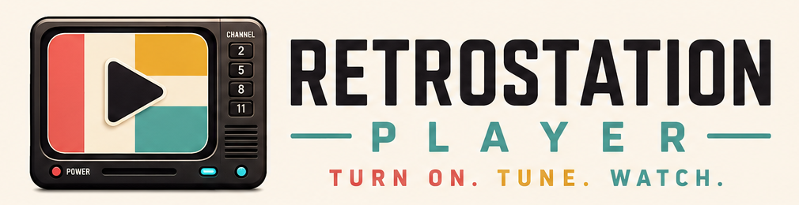

# RetroStation Player

<p align="center">
  <a href="https://github.com/thehack904/RetroStation-Player">
    
  </a>
  <a href="https://creativecommons.org/licenses/by-nc-sa/4.0/">
    
  </a>
</p>
<p align="center">
  
</p>

RetroStation Player turns a Raspberry Pi or Linux computer into a dedicated TV player. Plug it into your television, point it at an IPTV playlist, and use any phone or browser on your network to pick channels — the video plays fullscreen on the connected display.

It pairs naturally with [RetroStation MC](https://github.com/thehack904/RetroStation_MC), [ErsatzTV](https://ersatztv.org/), [Tunarr](https://github.com/chrisbenincasa/tunarr), and any other service that provides an M3U channel list.

---

## What it does

- **Pick a channel from your phone or browser** — the Web UI shows your full channel list with logos, names, and numbers
- **Plays fullscreen on the connected TV** — no remote, no keyboard required on the player itself
- **Works over HDMI or composite (CRT) output** — connect to a modern TV or a classic television
- **Remembers where you left off** — resumes the last channel automatically after a reboot
- **Adjusts volume from the Web UI** — no need to reach for the TV remote (analog/composite output)
- **Shows a built-in log viewer** — useful when something goes wrong

---

## Supported hardware

| Device | HDMI | Composite (CRT) |
|---|:---:|:---:|
| Raspberry Pi Zero W | ✅ | — |
| Raspberry Pi 3 Model B / B+ | ✅ | ✅ |
| Raspberry Pi 4 | ✅ | ✅ |
| Raspberry Pi 5 | ✅ | — |
| Debian / Ubuntu x86 Linux | ✅ | — |

---

## Quick start

**1. Download and extract** the latest release, then open a terminal in its folder.

**2. Run the installer** (connect your TV before running):

```bash
sudo ./scripts/setup.sh install --display auto
```

The installer detects your display automatically and installs everything needed.

**3. Open the Web UI** from any device on the same network:

```
http://PLAYER-IP:5050
```

**4. Enter your M3U playlist URL** in Settings and save. Your channels will load and you can start watching.

> **Tip:** If Settings opens automatically on first launch, that just means the player is waiting for a playlist URL — enter yours and you're good to go.

---

## Limitations

- One player and one M3U source per installation
- No built-in login — intended for use on a trusted home network
- No TV guide, recording, or DVR features
- HDMI volume is controlled by your TV or receiver, not the Web UI

---

## Going further

For full installation options, display mode details, audio configuration, uninstall instructions, and advanced topics, see [INSTALL.md](INSTALL.md).

For what's coming next, see [ROADMAP.md](ROADMAP.md).

---

## License

See [LICENSE](LICENSE).
